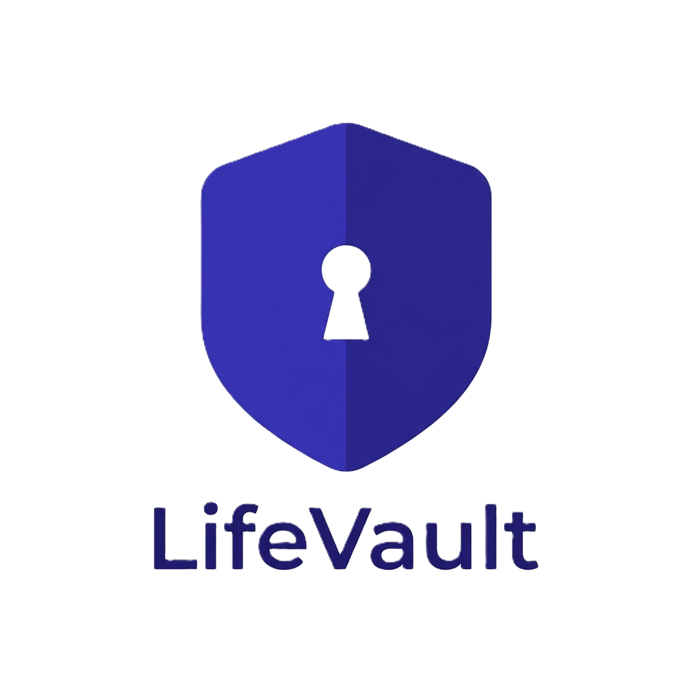

<div align="center">
  

  # LifeVault

  **Tu bóveda personal segura, con un asistente de IA que entiende tus documentos.**

  App móvil para guardar tu documentación vital de forma cifrada, consultarla en lenguaje natural mediante IA y gestionar tu día a día con un planner sincronizado con Google.

      
</div>

---

## ¿Qué es LifeVault?

La documentación importante de nuestra vida —DNI, contratos, pólizas, facturas— suele estar dispersa entre el correo, la galería del móvil y carpetas sueltas, y es prácticamente imposible de consultar cuando hace falta. Servicios como Drive o Dropbox **almacenan** los archivos, pero no los **entienden**.

LifeVault resuelve esto con tres piezas:

1. **🔒 Bóveda cifrada** — guardas tus documentos (PDF, imágenes) en un único lugar seguro. El contenido se cifra con **AES-256** antes de almacenarse.
2. **🤖 Asistente de IA** — preguntas en lenguaje natural y la IA responde leyendo *tus* documentos, con la respuesta apareciendo **en streaming** palabra a palabra.
3. **🗓️ Planner** — tareas y eventos con **sincronización bidireccional** con Google Calendar y Google Tasks.

---

## Funcionalidades

- **Autenticación** con Supabase Auth (email/contraseña) y **Google Sign-In**.
- **Bóveda de documentos**: subida desde el móvil a Supabase Storage, listado y gestión; contenido cifrado con AES-256 (pgcrypto).
- **Asistente IA**: chat con **streaming SSE** (Server-Sent Events sobre XHR, porque React Native no soporta streaming nativo), renderizado de Markdown sin dependencias externas, adjuntos y **historial persistente** por sesión.
- **Planner**: CRUD de tareas y eventos con **sync bidireccional** Google Calendar + Google Tasks.
- **Ajustes**: editar perfil, cambiar contraseña, suscripción, notificaciones, privacidad y ayuda.
- **Experiencia**: modo claro/oscuro, **i18n** (español / inglés), toasts, skeleton loaders y pull-to-refresh.

---

## Stack

| Capa | Tecnología |
|------|-----------|
| Framework | Expo SDK 54 · React Native 0.81 · React 19 |
| Navegación | Expo Router 6 (typed routes) |
| Estado | Zustand 5 |
| Estilos | NativeWind 4 (Tailwind CSS) |
| Animación | Reanimated 4 |
| Backend | Supabase (Auth · Postgres · Storage · Edge Functions) |
| i18n | i18n-js + expo-localization |
| Testing | Jest (jest-expo) + Testing Library |
| Build | EAS Build |

---

## Estructura del proyecto

```
LifeVaultMobile/
├── app/                    # Rutas (Expo Router)
│   ├── (auth)/             #   Login y flujo de autenticación
│   └── (tabs)/             #   index · vault · assistant · planner · settings
├── components/             # Componentes de UI reutilizables
├── store/                  # Stores de Zustand (auth, documents, assistant,
│                           #   tasks, events, theme, i18n)
├── lib/                    # Lógica y clientes
│   ├── supabase.ts         #   Cliente Supabase
│   ├── api.ts              #   Llamadas a la API + streaming SSE del asistente
│   ├── google-auth.ts      #   Google Sign-In
│   ├── google-calendar.ts  #   Integración Google Calendar
│   ├── google-tasks.ts     #   Integración Google Tasks
│   ├── google-sync.ts      #   Sincronización bidireccional
│   ├── i18n.ts             #   Internacionalización
│   ├── errors.ts           #   Manejo de errores
│   └── toast.tsx           #   Sistema de toasts
├── constants/              # colors.ts · typography.ts
├── design-system/          # Tokens de diseño
├── locales/                # es.json · en.json
├── __tests__/              # Tests (99 tests)
├── android/                # Proyecto nativo Android
├── assets/                 # Logos e imágenes
├── website/                # Web pública (verificación OAuth de Google)
└── presentacion-tfm/       # Presentación interactiva del TFM
```

---

## Puesta en marcha

### Requisitos

- Node.js 20+
- Una cuenta de [Supabase](https://supabase.com) y un proyecto creado
- Credenciales de OAuth de Google (para Sign-In y sincronización)
- Para correr en dispositivo: un **dev client** de Expo (este proyecto usa módulos nativos, no funciona con Expo Go)

### Instalación

```bash
npm install
```

> El proyecto fija `react-native-worklets@0.8.3` (excluido del autoupgrade de Expo). No lo bajes a 0.5.1 aunque `expo-doctor` lo sugiera: rompe el bundling de Metro.

### Variables de entorno

Crea un archivo `.env` en la raíz con:

```bash
EXPO_PUBLIC_SUPABASE_URL=https://<tu-proyecto>.supabase.co
EXPO_PUBLIC_SUPABASE_ANON_KEY=<tu-anon-key>
EXPO_PUBLIC_GOOGLE_WEB_CLIENT_ID=<tu-google-web-client-id>
EXPO_PUBLIC_N8N_UPLOAD_URL=<webhook-de-subida-de-documentos>
```

> Las claves nunca se suben a git. En builds de EAS se inyectan como *secrets*.

### Ejecutar

```bash
npm start          # Servidor de desarrollo de Expo
npm run android    # Compilar y ejecutar en Android
npm run ios        # Compilar y ejecutar en iOS
```

---

## Testing

```bash
npm test               # Ejecuta la suite (99 tests)
npm run test:watch     # Modo watch
npm run test:coverage  # Con cobertura
```

Cobertura sobre stores, helpers (`lib/errors`, `lib/i18n`) y componentes de UI. La CI (GitHub Actions) corre `tsc --noEmit` + `npm test` en cada push/PR a `main`.

---

## Build (EAS)

```bash
eas build --profile preview     --platform android   # APK de prueba
eas build --profile production  --platform android   # AAB para Play Store
```

---

## Seguridad

- **Cifrado en reposo**: el contenido de los documentos se cifra con **AES-256** (pgcrypto) mediante funciones SQL `vault_encrypt_content` / `vault_decrypt_content`; la Edge Function `ai-assistant` descifra bajo demanda con un secret de servidor.
- **RLS** (Row Level Security) habilitado en todas las tablas, con filtrado por `user_id`.
- Las credenciales sensibles viven en variables de entorno / secrets de EAS, nunca en el código.

---

<div align="center">
  <sub>Proyecto desarrollado como Trabajo de Fin de Máster · Pablo Mérida</sub>
</div>
